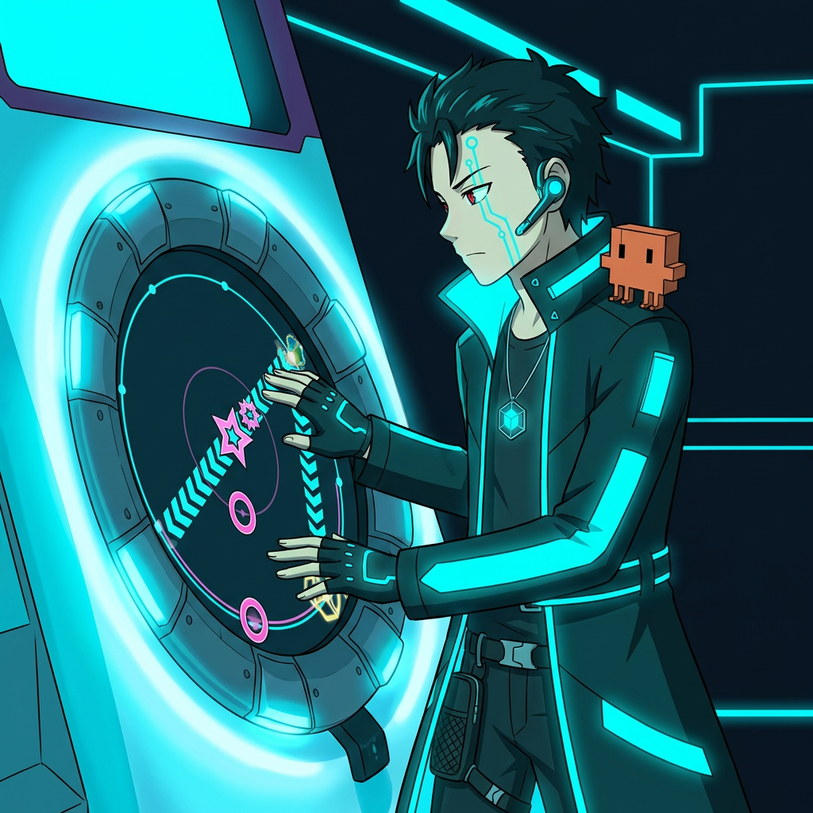

# maimai

**AI-powered chart pattern detection for maimai — all planned to be built through agentic coding with Claude Code.**

> Being built through agentic coding with [Claude Code](https://claude.ai/claude-code). The AI researches, codes, iterates, and ships — while the human validates by reviewing gameplay captures and testing on a simulator.

---

## What is maimai?

[maimai](https://maimai.sega.jp/) is a SEGA arcade rhythm game with a circular screen surrounded by 8 touch-sensitive buttons. Players tap, hold, and slide along the screen in time with music. Unlike lane-based rhythm games, maimai's 360-degree layout enables unique spatial patterns — including techniques where both hands must operate independently, creating some of the hardest coordination challenges in any rhythm game.

This project applies AI to understand and detect these patterns.

## What's Shipped

### [Chart Pattern Detector](detector/) — 9 patterns

Structural detectors for maimai chart patterns: **Umiyuri (海底譚)**, **拍滑**, **slide reading**, **轉圈/掃鍵**, **縦連**, **トリル**, **乱打/散打**. No ML — pure structural rules derived from understanding game mechanics. Includes a NiceGUI web dashboard with multi-timeline visualization and per-pattern leaderboards.

See [detector/](detector/) for the full story.

## How It Was Built

The detectors emerged through **agentic test-driven development** over 13+ hours:

1. **Research** — Started from zero maimai knowledge. Parallel web research agents covered mechanics, simai format, community terminology (JP/CN/EN), and existing AI work.

2. **Umiyuri deep-dive** — The Umiyuri detector went through 20+ iterations of the AI proposing rules → verifying against the DB → human reviewing gameplay captures → reporting false positives → AI fixing. This produced the positional chain rule and the understanding of slide timing mechanics that unlocked all subsequent detectors.

3. **Rapid expansion** — With the foundational understanding of slide timing (1-beat delay, star position mechanics, hand independence), the 拍滑, slide reading, and all tap-based detectors were built quickly. The 拍滑 detector worked on the first try. The 乱打 detector matched 10/10 community-cited songs immediately.

4. **Community validation** — Every detector was cross-referenced against community sources (JP: Gamerch wiki, kioblog; CN: Bahamut, Bilibili; EN: Reddit). Rotation detection matched 14/14 community-cited songs.

## Future Work

- **一筆畫 detector** — one-stroke connected slide patterns
- **魔法陣 detector** — center-crossing rotational slides
- **Audio-to-chart pipeline** — beat detection → pattern slotting → simai output
- **Player recommendations** — "play X to improve your Umiyuri" / "play Y for easy rating"
- **Chart generation** — data-driven, learning from the corpus

## License

MIT
