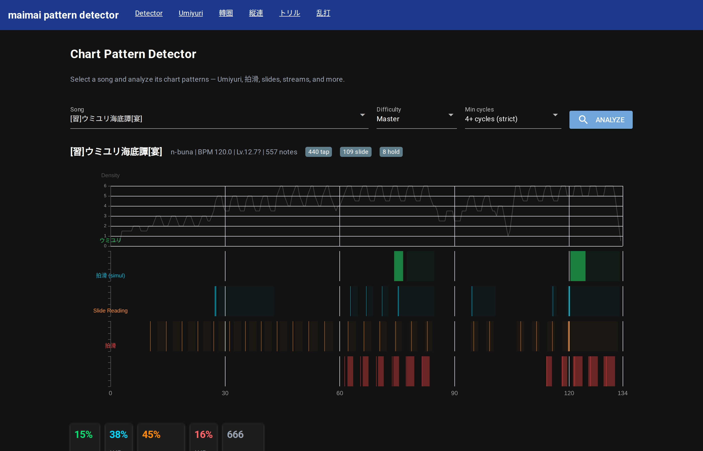
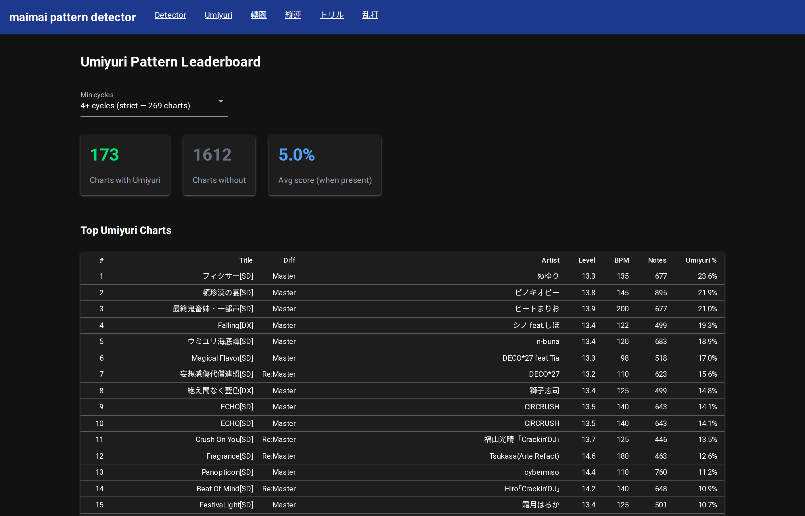
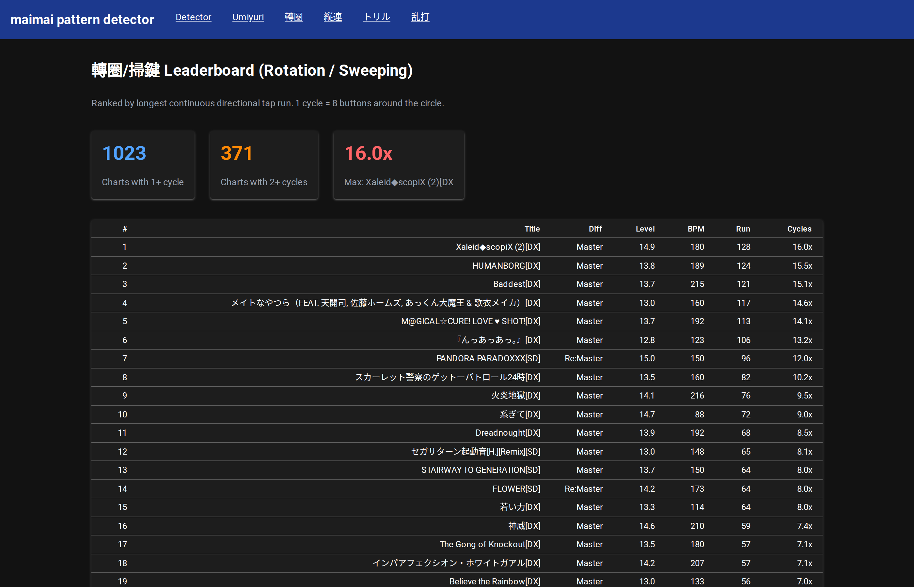
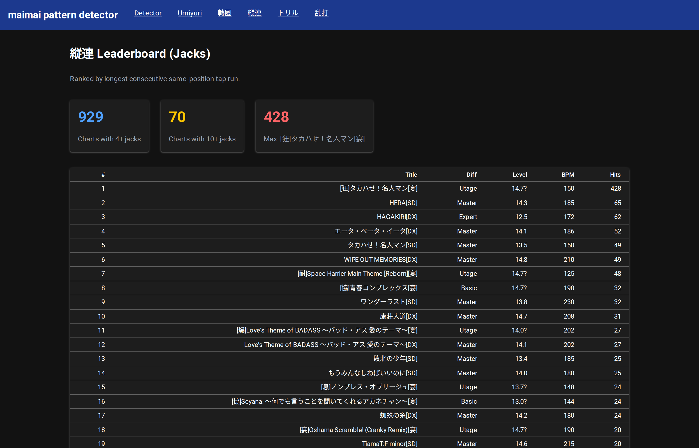

# Chart Pattern Detector

**9 structural pattern detectors for maimai charts, built through agentic test-driven development with Claude Code.**

> Built through agentic coding with [Claude Code](https://claude.ai/claude-code). The AI wrote the code, ran the experiments, and iterated on false positives — while the human validated by reviewing gameplay captures and testing on a simulator.

---

### Multi-timeline detector — all patterns analyzed simultaneously



### Leaderboard — 173 charts ranked by Umiyuri percentage



### Pattern leaderboards




## What This Is

A suite of structural pattern detectors for maimai chart files. Each detector identifies a specific technique by analyzing the chart's note sequence — no ML, pure structural rules.

The system:
- **Parses simai chart format** (maidata.txt) into timestamped note events with proper slide timing (1-beat delay)
- **9 pattern detectors**: Umiyuri, 拍滑, slide reading, rotation, jacks, trills, 乱打, 一筆畫, 魔法陣
- **Reports combo ranges and timestamps** for each detected section
- **NiceGUI web dashboard** with multi-timeline visualization and leaderboards
- **Community-validated**: Umiyuri 97% accuracy (31 ground truth), rotation 14/14, 乱打 10/10

## The Detectors

### Slide-based

| Detector | Charts | Key insight |
|---|---|---|
| **Umiyuri** | 173 | Positional chain: `tap(t) == slide(t-1).start` |
| **拍滑** | 905 | Simultaneous tap+slide at different positions |
| **Slide Reading** | 1,309 | Taps during the 1-beat delay window (not simultaneous) |

### Tap-based

| Detector | Charts | Key insight |
|---|---|---|
| **轉圈/掃鍵** | 1,023 | Longest directional run in cycles (8 taps = 1 circle) |
| **縦連** | 929 | Longest same-position run |
| **トリル** | 2,157 | Longest alternating two-position run (with cross-hand distance) |
| **乱打/散打** | 2,472 | Longest non-directional run (≥30% direction changes) |

---

## The Umiyuri Story

This is the detector that started it all — and the one that taught us everything about maimai chart mechanics.

## The Pattern

The Umiyuri pattern, named after the song ウミユリ海底譚 where it famously appears, is defined by:

```
t=0:  Hand A taps star (queues slide, 1-beat delay before movement)
t=1:  Hand B taps independently (while slide begins moving)
t=2:  Hand A's slide arrives; Hand A taps new star (queues next slide)
t=3:  Hand B taps independently again
      ...cycle repeats, alternating hands
```

The core structural rule discovered through iterative testing:

> **tap(t).position == slide(t-1).start_position** — the tap in each cycle is at the same position where the previous slide's star was hit, because that's where the hand already is.

Two variants detected:
- **Classic**: The positional chain rule holds — taps explicitly reinforce slide positions
- **Fragrance-type**: Consecutive slides start from the same position (self-reinforcing 拍滑) — the next star head prevents early swiping of the previous slide

## The Journey

### Act 0: Research Phase

Starting from zero knowledge of maimai, the AI researched rhythm games, maimai mechanics, simai chart format, and community terminology through parallelized web research agents. Key discovery: the existence of named chart patterns like ウミユリ配置, with community resources in Japanese, Chinese, and English.

### Act 1: Data Acquisition

- **1,717 chart files** from Maichart-Converts (simai format)
- **1,184 audio+chart files** (6.1GB) transferred from a Windows node via SCP across the homelab
- **31 player score profiles** from mai-tools bookmarklet exports

### Act 2: Parser & Feature Extraction

Built a simai parser from scratch, handling BPM changes, subdivision changes, touch notes (DX), slide duration parsing, and the critical 1-beat slide delay. Added combo counting (tap=1, break=1, hold=1, slide=2, touch=1) for mapping detections to gameplay footage.

### Act 3: The Umiyuri Detector — Iterative TDD

This is where the agentic TDD loop proved its worth. The detector went through **6+ major revisions**, each driven by the human reviewing results on actual charts and reporting false positives/negatives.

**v0**: Simple feature-based (slide ratio, each ratio) — too many false positives
**v1**: Slide endpoint interlock (taps at slide endpoints) — separated Umiyuri from 拍滑
**v2**: Strict T-S-T-S alternation scan — eliminated sequential slide chains
**v3**: Hand independence check (taps during slide travel window)
**v4**: Positional chain rule (tap(t) == slide(t-1).start) — the breakthrough
**v5**: Fragrance-type variant, back-to-back checks, tap alternation, mismatch budget

Each revision was validated against growing ground truth before deployment — a rule that looked logical on paper could cause regressions elsewhere. The discipline of "verify against DB, then deploy" prevented dozens of bad iterations.

### Key False Positive Classes Eliminated

| False Positive | Root Cause | Rule That Fixed It |
|---|---|---|
| Sequential slides (WARNING) | One hand doing slide→tap→slide | Hand independence: taps must occur during slide travel |
| 拍滑 (Freak Out Hr) | Simultaneous tap+slide, no alternation | Single-tap ratio: tap groups must include solo taps |
| Repetitive loops (アイドル新鋭隊) | Same 2-slide motif repeated | No back-to-back identical slides |
| Same-position hammering (コネクト) | One hand stuck on same button | No back-to-back same-position taps (>70% threshold) |
| Random each+slide (青春コンプレックス) | Tap not at slide start position | Positional chain rule |

### Ground Truth

| Song | Edition | Score | Variant |
|---|---|---|---|
| ウミユリ海底譚 | SD MAS | 18.9% | classic |
| フィクサー | SD MAS | 23.6% | classic |
| ECHO | SD MAS | 14.1% | classic + fragrance |
| 妄想感傷代償連盟 | SD ReMAS | 15.6% | classic |
| Fragrance | SD ReMAS | 12.6% | fragrance-type |
| Falling | DX MAS | 19.3% | classic |
| 頓珍漢の宴 | SD MAS | 21.9% | classic |
| 絶え間なく藍色 | DX MAS | 14.8% | classic |
| RIFFRAIN | DX MAS | 9.2% | classic |
| + 11 more confirmed positives | | | |
| 11 confirmed negatives | | 0.0% | — |

### Act 4: The 1-Beat Slide Delay — The Key That Unlocked Everything

A [YouTube video](https://www.youtube.com/watch?v=k4MuJr8f9t4) from Maimai Inner Project revealed the critical mechanic: **slides don't start immediately**. There's a 1-beat (quarter note) delay between tapping the star and the slide beginning to move. This is BPM-dependent (500ms at 120 BPM, 333ms at 180 BPM).

This single insight explained:
- Why 拍滑 works: the tap at the star position **prevents early swiping** during the delay
- Why Umiyuri feels like hand-independence: the tap resolves the PREVIOUS slide's arrival, while the NEW slide waits 1 beat
- The positional chain rule: `tap(t).position == slide(t-1).start_position` — verified at 90-100% on all confirmed songs

Confirmed from [SimaiSharp source code](https://github.com/reflektone-games/SimaiSharp): default delay = `SecondsPerBeat`. Can be overridden with `[D##X:Y]` syntax.

### Act 5: 拍滑 and Slide Reading — Built in One Try

With the slide delay understood, the 拍滑 detector worked **on the first attempt**. The rule: find each(tap+slide) groups where tap and slide are at different positions (different hands). Future Re:Master ranked #1 at 82.5% — exactly what the community calls "the canonical 拍滑 practice chart."

The **slide reading** detector followed naturally: taps placed during the delay window (after star tap, before slide action) but NOT simultaneous. These are the notes beginners miss because they mentally "check out" during slides. A structurally distinct pattern from 拍滑 — different failure mode, different skill.

### Act 6: Tap Patterns — Streams, Jacks, Trills, 乱打

The coarse window-based detectors from Act 2 were replaced with **run-based** metrics — because as the human pointed out, accumulative error means short bursts are forgiving but long stretches are where you die.

- **轉圈/掃鍵 (Rotation)**: longest directional run in cycles. 14/14 community-cited songs matched.
- **縦連 (Jacks)**: longest same-position run. [狂]タカハせ！名人マン at 428 hits.
- **トリル (Trills)**: longest alternating two-position run, with distance metric for cross-hand.
- **乱打/散打 (Scattered)**: longest run with ≥30% direction changes. 10/10 community songs matched. ナイト・オブ・ナイツ — "the archetype of 乱打" per community wiki — correctly detected.

### Act 7: Community Validation and Terminology

Every detector was cross-referenced against JP, CN, and EN community sources:

| Term (JP) | Term (CN) | Our detector |
|---|---|---|
| ウミユリ配置 / 海底譚配置 | 海底谭配置 / 错位星 | Umiyuri detector |
| 拍滑 | 拍滑 / 同起点slide | 拍滑 detector |
| 回転 / 流し | 轉圈 / 掃鍵 | Rotation (cycles) |
| 縦連 | 縦連 | Jacks (longest run) |
| トリル | 交叉 | Trills (with distance) |
| 乱打 | 散打 | Scattered (direction changes) |
| 物量 | 物量 | Not a pattern — raw note density |

Sources: [Gamerch wiki](https://gamerch.com/maimai/533406), [kioblog 10 Famous Patterns](https://gekkouga-kio.hatenablog.com/entry/2023/12/18/000144), [Tonevo Advent Calendar](https://tonevoadventcalendar.hatenablog.com/entry/2023/12/14/2), [Bahamut guide](https://forum.gamer.com.tw/C.php?bsn=21890&snA=955), [乱打のお話 blog](https://keionkakimasen.hatenablog.com/entry/2024/12/25/111359)

### Act 8: Slide Pattern Detectors — 一筆畫 and 魔法陣

With the slide trajectory geometry understood, two slide-specific detectors emerged:

**一筆畫 (One-Stroke)**: Consecutive slides where each endpoint is the next start — a continuous drawing path. The detector chains slides by matching `slide(N).end == slide(N+1).start`. Confirmed on アリサのテーマ (38-chain) and インドア系ならトラックメイカー.

**魔法陣 (Magic Circle)**: Distance-4 straight slides spaced 1 beat apart, whose trajectories cross each other while multiple slides are active on screen. Four rules: (1) straight `-` shape only, (2) distance-4 (through center), (3) beat-spaced, (4) progressive rotation (≥70% unique start positions — eliminates alternating patterns). Confirmed on One Step Ahead, 泥の分際で, アンビバレンス, 前前前世. False positives eliminated: にゃーにゃー (non-straight), Future (repetitive), 39 (alternating not rotating).

### Act 9: The Full Picture

9 structural detectors, each targeting a specific maimai technique. The Umiyuri detector took 20+ iterations over 6 hours. The other 9 were built in under 4 hours — because the foundational understanding of slide timing, hand independence, and chart structure transferred directly. Every detector was validated against community sources (JP/CN/EN) and human ground truth before shipping.

## Files

| File | Description |
|---|---|
| `simai_parser.py` | Simai chart format parser with slide timing, touch note handling, combo counting |
| `umiyuri_detector.py` | The Umiyuri pattern detector (classic + fragrance-type variants) |
| `app.py` | NiceGUI web dashboard with pattern detector, leaderboard, and mai-notes.com integration |
| `pattern_ground_truth.json` | 20 confirmed positives, 11 confirmed negatives |
| `research-slide-timing.md` | Documentation of the 1-beat slide delay mechanic |
| `research-umiyuri-songs.md` | Community-sourced Umiyuri song lists (JP/CN/EN) |
| `requirements.txt` | Python dependencies |

## What Makes This Portfolio-Worthy

### Agentic TDD Actually Works

The detector wasn't designed top-down. It emerged through a tight loop: AI proposes rule → runs against DB → human reviews gameplay captures → reports false positives → AI diagnoses root cause → proposes fix → validates → deploys. Over 6+ hours and 20+ iterations, the detector went from "flags everything with slides" to "97% accuracy with structural rules derived from actual gameplay mechanics."

### Domain Knowledge Is Earned, Not Assumed

The AI started knowing nothing about maimai. Every rule in the detector maps to a real gameplay mechanic:
- The 1-beat slide delay (confirmed from SimaiSharp source code)
- The positional chain (tap at star position = hand is already there)
- Self-reinforcing 拍滑 (next star head prevents early swipe)

These weren't guessed — they were discovered through data analysis and validated by a player.

### Perseverance Through the Out-of-Distribution

Building a rhythm game pattern detector is wildly out of distribution for an AI coding assistant. The project succeeded because both sides — human and AI — refused to stop iterating. 27 false positives were reported and eliminated. Each one taught the detector something new about what Umiyuri actually is.

## Running

```bash
# Install dependencies
python -m venv venv && source venv/bin/activate
pip install -r requirements.txt

# Run the detector on a chart
python umiyuri_detector.py path/to/maidata.txt 5  # 5=Master, 6=Re:Master

# Start the web dashboard (requires chart data in Maichart-Converts-* directory)
python app.py
# Visit http://localhost:8888
```

## Future Work

- **Additional pattern detectors**: 拍滑, 一筆畫, streams, jacks (infrastructure exists, archived for now)
- **Beat detection pipeline**: Audio analysis for chart generation (librosa + madmom)
- **Chart generation**: Data-driven chart creation using pattern understanding
- **Player analysis**: Per-player pattern weakness detection from score data (31 players ready)

## License

MIT
