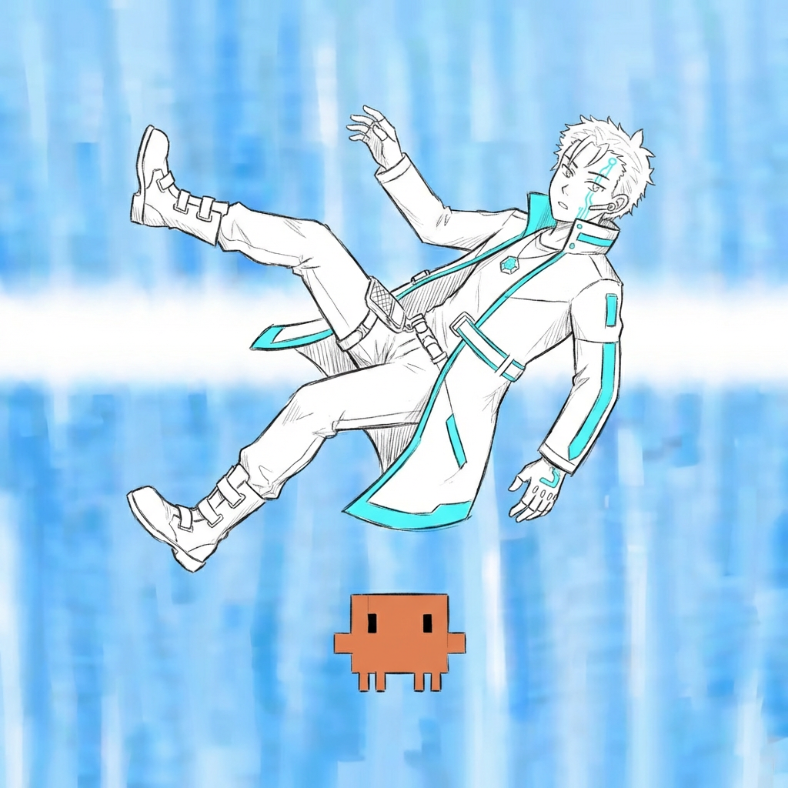
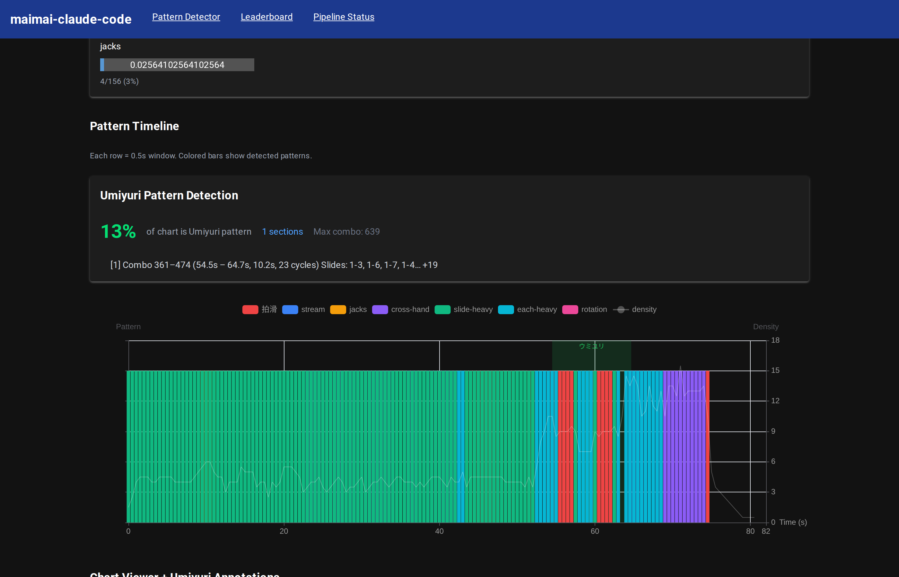
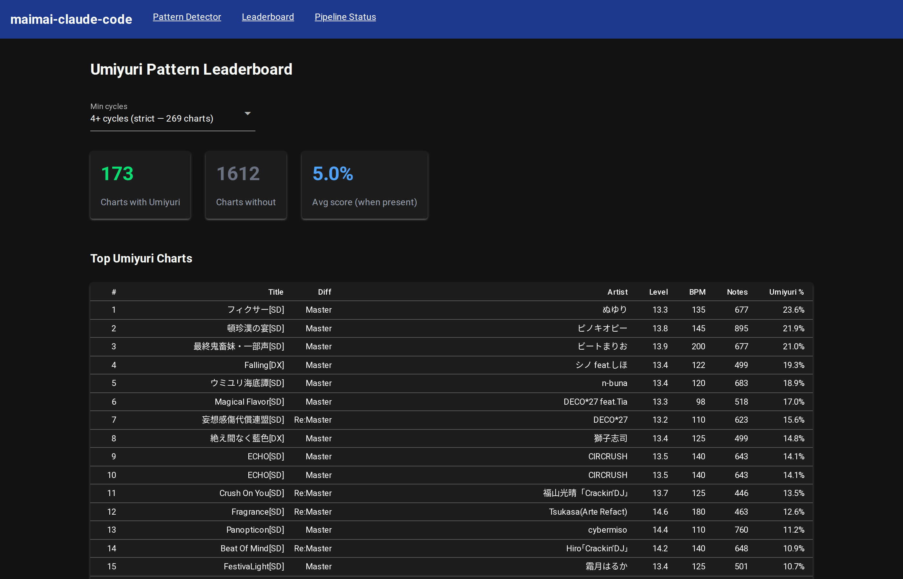

# Umiyuri

**An AI-powered detector for the ウミユリ (海底譚) chart pattern in maimai, built through agentic test-driven development with Claude Code.**

> Built entirely through agentic coding with [Claude Code](https://claude.ai/claude-code). The AI wrote the code, ran the experiments, and iterated on false positives — while the human validated by reviewing gameplay captures and testing on a simulator.

---

### Fragrance Re:Master — Umiyuri detected only towards the end of the song



### Leaderboard — 172 charts ranked by Umiyuri percentage



## What This Is

A structural pattern detector that identifies the **Umiyuri pattern** (ウミユリ配置 / 海底譚配置) in maimai chart files. The Umiyuri pattern is one of the most feared techniques in maimai — both hands must operate independently, alternating between tapping and sliding in an interlocking cycle.

The detector:
- **Parses simai chart format** (maidata.txt) into timestamped note events
- **Detects classic and fragrance-type Umiyuri** via structural rules, not ML
- **Reports combo ranges and timestamps** for each detected section
- **Serves a NiceGUI web dashboard** with interactive leaderboard and mai-notes.com integration
- **97% accuracy** on 31 ground-truth samples (20 true positives, 11 true negatives)
- **[173 charts detected →](DETECTIONS.md)** full ranked table of every detection

## The Pattern

The Umiyuri pattern, named after the song ウミユリ海底譚 where it famously appears, is defined by:

```
t=0:  Hand A taps star (queues slide, 1-beat delay before movement)
t=1:  Hand B taps independently (while slide begins moving)
t=2:  Hand A's slide arrives; Hand A taps new star (queues next slide)
t=3:  Hand B taps independently again
      ...cycle repeats, alternating hands
```

The core structural rule discovered through iterative testing:

> **tap(t).position == slide(t-1).start_position** — the tap in each cycle is at the same position where the previous slide's star was hit, because that's where the hand already is.

Two variants detected:
- **Classic**: The positional chain rule holds — taps explicitly reinforce slide positions
- **Fragrance-type**: Consecutive slides start from the same position (self-reinforcing 拍滑) — the next star head prevents early swiping of the previous slide

## The Journey

### Act 0: Research Phase

Starting from zero knowledge of maimai, the AI researched rhythm games, maimai mechanics, simai chart format, and community terminology through parallelized web research agents. Key discovery: the existence of named chart patterns like ウミユリ配置, with community resources in Japanese, Chinese, and English.

### Act 1: Data Acquisition

- **1,717 chart files** from Maichart-Converts (simai format)
- **1,184 audio+chart files** (6.1GB) transferred from a Windows node via SCP across the homelab
- **31 player score profiles** from mai-tools bookmarklet exports

### Act 2: Parser & Feature Extraction

Built a simai parser from scratch, handling BPM changes, subdivision changes, touch notes (DX), slide duration parsing, and the critical 1-beat slide delay. Added combo counting (tap=1, break=1, hold=1, slide=2, touch=1) for mapping detections to gameplay footage.

### Act 3: The Umiyuri Detector — Iterative TDD

This is where the agentic TDD loop proved its worth. The detector went through **6+ major revisions**, each driven by the human reviewing results on actual charts and reporting false positives/negatives.

**v0**: Simple feature-based (slide ratio, each ratio) — too many false positives
**v1**: Slide endpoint interlock (taps at slide endpoints) — separated Umiyuri from 拍滑
**v2**: Strict T-S-T-S alternation scan — eliminated sequential slide chains
**v3**: Hand independence check (taps during slide travel window)
**v4**: Positional chain rule (tap(t) == slide(t-1).start) — the breakthrough
**v5**: Fragrance-type variant, back-to-back checks, tap alternation, mismatch budget

Each revision was validated against growing ground truth before deployment — a rule that looked logical on paper could cause regressions elsewhere. The discipline of "verify against DB, then deploy" prevented dozens of bad iterations.

### Key False Positive Classes Eliminated

| False Positive | Root Cause | Rule That Fixed It |
|---|---|---|
| Sequential slides (WARNING) | One hand doing slide→tap→slide | Hand independence: taps must occur during slide travel |
| 拍滑 (Freak Out Hr) | Simultaneous tap+slide, no alternation | Single-tap ratio: tap groups must include solo taps |
| Repetitive loops (アイドル新鋭隊) | Same 2-slide motif repeated | No back-to-back identical slides |
| Same-position hammering (コネクト) | One hand stuck on same button | No back-to-back same-position taps (>70% threshold) |
| Random each+slide (青春コンプレックス) | Tap not at slide start position | Positional chain rule |

### Ground Truth

| Song | Edition | Score | Variant |
|---|---|---|---|
| ウミユリ海底譚 | SD MAS | 18.9% | classic |
| フィクサー | SD MAS | 23.6% | classic |
| ECHO | SD MAS | 14.1% | classic + fragrance |
| 妄想感傷代償連盟 | SD ReMAS | 15.6% | classic |
| Fragrance | SD ReMAS | 12.6% | fragrance-type |
| Falling | DX MAS | 19.3% | classic |
| 頓珍漢の宴 | SD MAS | 21.9% | classic |
| 絶え間なく藍色 | DX MAS | 14.8% | classic |
| RIFFRAIN | DX MAS | 9.2% | classic |
| + 11 more confirmed positives | | | |
| 11 confirmed negatives | | 0.0% | — |

## Files

| File | Description |
|---|---|
| `simai_parser.py` | Simai chart format parser with slide timing, touch note handling, combo counting |
| `umiyuri_detector.py` | The Umiyuri pattern detector (classic + fragrance-type variants) |
| `app.py` | NiceGUI web dashboard with pattern detector, leaderboard, and mai-notes.com integration |
| `pattern_ground_truth.json` | 20 confirmed positives, 11 confirmed negatives |
| `research-slide-timing.md` | Documentation of the 1-beat slide delay mechanic |
| `research-umiyuri-songs.md` | Community-sourced Umiyuri song lists (JP/CN/EN) |
| `requirements.txt` | Python dependencies |

## What Makes This Portfolio-Worthy

### Agentic TDD Actually Works

The detector wasn't designed top-down. It emerged through a tight loop: AI proposes rule → runs against DB → human reviews gameplay captures → reports false positives → AI diagnoses root cause → proposes fix → validates → deploys. Over 6+ hours and 20+ iterations, the detector went from "flags everything with slides" to "97% accuracy with structural rules derived from actual gameplay mechanics."

### Domain Knowledge Is Earned, Not Assumed

The AI started knowing nothing about maimai. Every rule in the detector maps to a real gameplay mechanic:
- The 1-beat slide delay (confirmed from SimaiSharp source code)
- The positional chain (tap at star position = hand is already there)
- Self-reinforcing 拍滑 (next star head prevents early swipe)

These weren't guessed — they were discovered through data analysis and validated by a player.

### Perseverance Through the Out-of-Distribution

Building a rhythm game pattern detector is wildly out of distribution for an AI coding assistant. The project succeeded because both sides — human and AI — refused to stop iterating. 27 false positives were reported and eliminated. Each one taught the detector something new about what Umiyuri actually is.

## Running

```bash
# Install dependencies
python -m venv venv && source venv/bin/activate
pip install -r requirements.txt

# Run the detector on a chart
python umiyuri_detector.py path/to/maidata.txt 5  # 5=Master, 6=Re:Master

# Start the web dashboard (requires chart data in Maichart-Converts-* directory)
python app.py
# Visit http://localhost:8888
```

## Future Work

- **Additional pattern detectors**: 拍滑, 一筆畫, streams, jacks (infrastructure exists, archived for now)
- **Beat detection pipeline**: Audio analysis for chart generation (librosa + madmom)
- **Chart generation**: Data-driven chart creation using pattern understanding
- **Player analysis**: Per-player pattern weakness detection from score data (31 players ready)

## License

MIT
